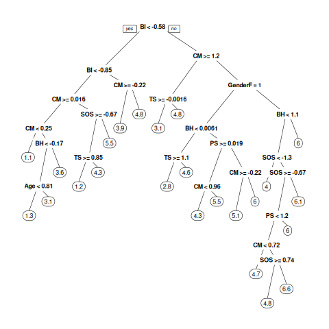
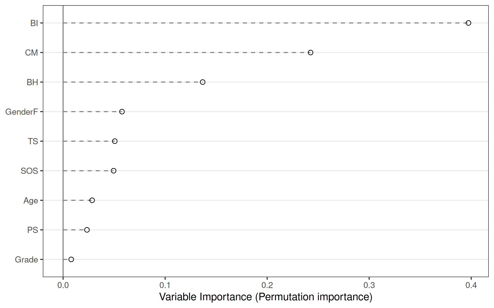
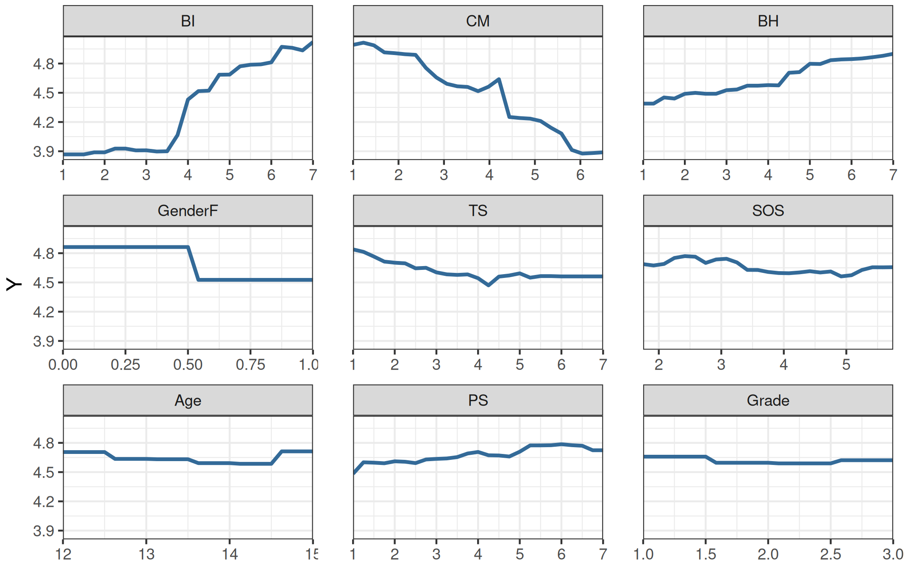

# Machine Learning-Informed Theory Construction

## Weekly Readings

```{r echo = FALSE, results = "asis"}
schedule <- readODS::read_ods("schedule.ods")
cat(paste0("* ", strsplit(schedule$Reading[which(schedule$file == "ml_informed.qmd")], split = "\n")[[1]]), sep = "\n")
```

## Tutorial

The topic of this week is to use machine learning to detect patterns in a dataset pertaining to your theory of interest.
I have prepared a reproducible example for you based on Self-Determination Theory in the `patterns_principles_exercises` project.
The purpose of this tutorial is **not** to give you a foundation in machine learning; that is too complex a topic. However, you should be able to run the code, you are allowed to play around with it and try making some changes, and you might be able to adapt and reuse it for future research projects.

It will probably surprise you that preparing the data for analysis is the most difficult part of this tutorial.
Expect to spend most of your time on this step - and **make sure to get the tutorial teacher's approval for your cleaned dataset before you go home**.


<!-- We will walk you through all the steps you might take for a machine learning analysis in the simplest possible form; you can choose to either just reproduce them without making changes, or you may experiment with your own data, or a different outcome variable from the same dataset. -->

### Step 1: Find a Dataset (30 minutes)

Search through [Google Database Search](https://datasetsearch.research.google.com/) for a dataset that covers some variables that can be considered operationalizations of the concepts in your theory.
One approach is to search the database for the name of your theory.
Another approach is to choose one, two, or three construct names from your theory, and search for those.


#### SDT Example: Codebook

I used the search term `"self determination theory"`, and read the descriptions of the datasets until I found the one by Zhao and Xu (2025) on "mental health, academic motivation, and perceived academic performance among Vietnamese students in online learning". It contains operationalizations of a few SDT constructs in the specific context of middle school students' academic stress and physical exercise behavior (we can debate how well this generalizes to SDT in general settings).
That's about as good an example as you can expect to find on short notice.
My dataset contains the following variables:

```{r}
tab_codebook <- read.csv("zhao_2025.csv")
knitr::kable(tab_codebook)
```


### Step 2: Preprocess the Data (30 minutes)

You will find a file called `prepare_zhao_2025.R` in the `patterns_principles_exercises` project.
Open that file.
Each section of code performs a specific data preprocessing step, as explained in the comments.
Work through the file one step at a time to prepare your own dataset for analysis.
Note that, for real research projects, you would probably do a lot more data cleaning than this - including solving problems specific to your dataset.
For the present tutorial, forget about any non-standard problems.
Just remove any variables that are not well-behaved.

### Step 3: Run the Analysis (20 minutes)

You will find a file called `analysis_zhao_2025.R` in the `patterns_principles_exercises` project. Open that file, and skim the comments to get a sense of the analysis steps.
If you have performed the data cleaning correctly, you should be able to run that file in its entirety without errors, and get machine learning results for your own theory.


### Step 4: Interpreting the Results (10 minutes)


We used four machine learning models that capture patterns in the data in different ways. Many other machine learning techniques exist, but most of these are common (except symbolic regression, but it's very interesting nonetheless). In this case, we used:

- **LASSO regression**, which models the outcome as a linear funciton of the predictors (just like normal regression) - but it shrinks the coefficients of less important predictors toward zero. It is easy to interpret because you can read the table of coefficients to evaluate the size and sign of the effect of included predictors, just like a table of regression coefficients. Irrelevant predictors are eliminated from the model.
- A **regression tree**, which captures patterns by repeatedly splitting the data into groups based on predictor values, producing a set of decision rules that can be interpreted directly. Note that, in this tree structure, an interaction effect like $X_1*X_2$ can be represented by first splitting on one interacting variable $X_1$, and then on the other, $X_2$. A nonlinear effect can be represented by splitting on the same variable at different values.
- **Random forests** combine predictions from many regression trees grown on slight permutations of the sample. They also capture potential interactions and nonlinear effects, and often capture much more detail of the patterns in data than a single tree, at the cost of a loss of interpretability. You can explain a forest's predictions using variable importance and partial dependence plots, which describe which predictors matter most for accurate predictions, and how each predictor affects the predictions while averaging across all other predictors, respectively.
- **Symbolic regression** constructs a mathematical expression, given a set of variables and mathematical operators, that reproduces patterns in the data. You can allow it to construct any kind of function, including nonlinear and interacting functions. The final model is an explicit equation, which can be interpreted at face value.

#### Model Fits

The first thing we do is interpret the table with model fits. Here, we use $R^2$ - which is a bit similar to the $R^2$ you might know as "explained variance" from linear regression. One key difference is that we have $R^2_{train}$ and $R^2_{test}$. The $R^2_{train}$ can be straightforwardly interpreted as the percentage of variance explained in the data the model already saw during training. The $R^2_{test}$ is a bit different: it looks at the variance explained by a specific model *in new data* (the test data), relative to just using the mean of the training data to predict new observations.

```{r results='markdown'}
table_fits <- read.csv("table_fits.csv")
if(knitr::is_latex_output()){
  names(table_fits) <- c("Model", "$R^2_{train}$", "$R^2_{test}$")
} else {
  names(table_fits) <- c("Model", "R<sup>2</sup><sub>train</sub>", "R<sup>2</sup><sub>test</sub>")
}
kableExtra::kbl(table_fits, digits = 2, escape = FALSE)
```

To pick the best model, it's most useful to look at $R^2_{test}$, because $R^2_{train}$ can be overly optimistic - a sufficiently complex model can literally memorize the correct value for all the training data, achieving a very high $R^2_{train} = 1.00$ but an abysmal $R^2_{test}$. 
This phenomenon is called "overfitting".

`r quiz("Which model seems to be most overfit?" = c(answer = "Regression tree", "Random forest", "LASSO", "Symbolic regression"), "Which model is least overfit?" = c(answer = "LASSO", "Symbolic regression", "Regression tree", "Random forest"), "The $R^2_{train}$ is positively biased" = TRUE, "The $R^2_{test}$ tells you how well your model generalizes to new data." = TRUE)`

Note that according to this metric, the random forest model is best. However, a random forest model is not interpretable - although you can analyze its predictions using measures like variable importance and partial dependence plots. Note that the LASSO model is almost equally good - and it is very straightforwardly interpretable. From a theory construction perspective, you might thus choose the LASSO model because it combines near-peak performance with high interpretability. 
The regression tree performs unacceptably (making much worse predictors than just taking the mean of the training data as prediction).
The symbolic regression model performs worse, but not completely unacceptably.

#### Interpret LASSO

To interpret the LASSO model, we look at its regression coefficients. These are interpreted the same as other regression coefficients, except that these are all biased towards zero:

```{r}
tab_lasso <- read.csv("table_lasso_coef.csv")
tab_lasso$X <- gsub("_", ".", tab_lasso$X, fixed=TRUE)
#tab_lasso <- tab_lasso[order(abs(tab_lasso[[2]]), decreasing = TRUE), ]
if(knitr::is_latex_output()){
  names(tab_lasso) <- c("Predictor", "$b_{\\lambda 1se}$")
} else {
 names(tab_lasso) <- c("Predictor", "b_lambda_1se") 
}
kableExtra::kbl(tab_lasso, digits = 2, escape = F, row.names = FALSE)
```


`r quiz("BI is one of the most influential predictors" = TRUE, "CM is the least influential predictor" = FALSE, "PS was dropped from the model" = TRUE)`


#### Interpret a Tree

You can interpret a regression tree by plotting it:



The plot tells us:

- which variables are selected at all; these are the relevant predictors
- how the model comes to a prediction: you navigate the decision tree based on your values on the predictor variables, until you reach the bottom of the tree. The predicted value is the label of the terminal node.
<!-- - Note that the previous example also illustrates a potential interaction between BI and CM because you first split on the one, and then on the other. -->

`r quiz("In this model, all variables are used." = TRUE, "To get a prediction, you start from the top: if your BI score is not lower than -.58, then go down the right branch" = TRUE, "The fact that the model first splits on BI and then on CM suggests a potential interaction between these two variables." = TRUE, "If the tree had been simpler (= less complex branching), it would be less overfit." = TRUE)`


#### Explain a Random Forest

Unlike a single tree, a random forest is not interpretable, but you can analyze/explain its predictions to some extent.

First, you can randomly shuffle each predictor, and see how much *worse* the model predicts when that happens. If shuffling one predictor really diminishes predictive performance, it must have been an important predictor.



To get a sense of the shape of the relationship between each predictor and the outcome (averaging over all other predictors), we can use "partial dependence plots":


`r quiz("Random forests gives a very different picture of what the most important predictors are than LASSO." = FALSE, "Whether you have low or medium levels of BI does not make a difference for your AM (the outcome)." = TRUE, "For increasing CM, we see an approximately linear decrease of AM" = TRUE, "The effect of GenderF could have any other shape than the step function we see here." = FALSE)`

#### Interpret Symbolic Regression

Finally, interpreting the symbolic regression model is very straightforward; just examine the equation constructed by the algorithm:

```{r results = "asis"}
knitr::asis_output(paste0("$", readLines("sr_expression.txt", warn = FALSE), "$"))
```


`r quiz("In this case, symbolic regression gives us a linear function" = TRUE, "The intercept of this function is:" = c(4.61, .01), "The slope of BI is" = c(1, .01))`

## Homework

If you managed to run the analysis, then you should now have machine learning results that tell you something about the predictors of one variable that (loosely) corresponds to a specific concept in your DAG.

Interpret the results you've obtained, 
and reflect on your previous theory (the DAG).
Do you see any predictors that are not in your DAG but should be?
Did you learn anything new about the direction of effects, about interaction effects, about the shape of association between concepts in your DAG?
Do any of the analyses have weird results that might have an explanation totally unrelated to your theory?
Write your reflections down to become part of your final report.
